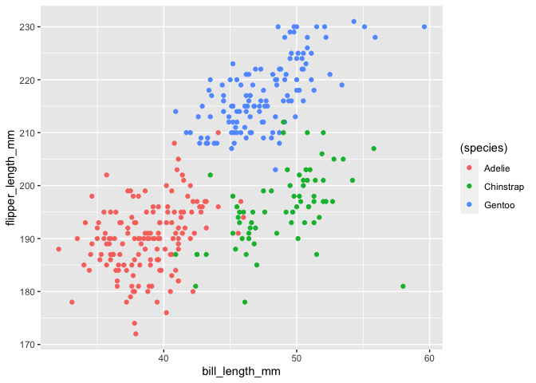

p8105\_hw1\_tz2472
================
tianwei zhao
9/26/2021

### Problem 1

This problem is intended to emphasize variable types and introduce
coercion; some awareness of how R treats numeric, character, and factor
variables is necessary for working with these data types in practice.

Create a data frame comprised of:

a random sample of size 10 from a standard Normal distribution a logical
vector indicating whether elements of the sample are greater than 0 a
character vector of length 10 a factor vector of length 10, with 3
different factor “levels” Try to take the mean of each variable in your
dataframe. What works and what doesn’t?

``` r
my_dataframe <- tibble(
  random_sample = rnorm(10),
  log_vector = random_sample>0,
  cha_vector = c("one", "two", "three", "four", "five", "six", "seven","eight", "nine", "ten"),
  fac_vector = factor(c("big","big","big","medium","medium","medium","small","small","small","small"))  #create the data frame
)
```

``` r
mean(pull(my_dataframe,random_sample)) #find mean of the random sample
```

    ## [1] -0.3759034

``` r
mean(pull(my_dataframe,log_vector)) #find mean of the logical vector
```

    ## [1] 0.2

``` r
mean(pull(my_dataframe,cha_vector)) # find mean of the character vector
```

    ## Warning in mean.default(pull(my_dataframe, cha_vector)): argument is not numeric
    ## or logical: returning NA

    ## [1] NA

``` r
mean(pull(my_dataframe,fac_vector)) # find mean of the factor vector
```

    ## Warning in mean.default(pull(my_dataframe, fac_vector)): argument is not numeric
    ## or logical: returning NA

    ## [1] NA

We can find the mean of random sample and logical vector, but we can not
find the mean of the character vector and factor vector.

#### In some cases, you can explicitly convert variables from one type to another. Write a code chunk that applies the as.numeric function to the logical, character, and factor variables (please show this chunk but not the output). What happens, and why? Does this help explain what happens when you try to take the mean?

``` r
num_log_vector = as.numeric(pull(my_dataframe,log_vector)) 
num_cha_vector = as.numeric(pull(my_dataframe,cha_vector))
num_fac_vector = as.numeric(pull(my_dataframe,fac_vector))
```

The logical vector can be converted into numeric vector as 0 or 1, since
R regards False as 0 and True as 1, and when calculating the mean, R
automatically calculates the mean of those 0s and 1s.And the mean of it
has real numerical value that how likely the sample is true.

The character vector can not be converted into numeric vector since the
character vector does not have an intrinsic numerical value, therefore,
R can not calculate the mean of it.

The factor vector can be converted into numeric vector since the levels
are converted into number as 1,2,3, indicating three different levels.
But those mean of levels does not have numerical meanings, thus R also
can not calculate the mean of it.

### Problem 2

Write a short description of the penguins dataset (not the penguins\_raw
dataset) using inline R code, including:

the data in this dataset, including names / values of important
variables the size of the dataset (using nrow and ncol) the mean flipper
length

#### describe the dataset and the size of data

``` r
data("penguins", package = "palmerpenguins")
penguins
```

    ## # A tibble: 344 × 8
    ##    species island    bill_length_mm bill_depth_mm flipper_length_mm body_mass_g
    ##    <fct>   <fct>              <dbl>         <dbl>             <int>       <int>
    ##  1 Adelie  Torgersen           39.1          18.7               181        3750
    ##  2 Adelie  Torgersen           39.5          17.4               186        3800
    ##  3 Adelie  Torgersen           40.3          18                 195        3250
    ##  4 Adelie  Torgersen           NA            NA                  NA          NA
    ##  5 Adelie  Torgersen           36.7          19.3               193        3450
    ##  6 Adelie  Torgersen           39.3          20.6               190        3650
    ##  7 Adelie  Torgersen           38.9          17.8               181        3625
    ##  8 Adelie  Torgersen           39.2          19.6               195        4675
    ##  9 Adelie  Torgersen           34.1          18.1               193        3475
    ## 10 Adelie  Torgersen           42            20.2               190        4250
    ## # … with 334 more rows, and 2 more variables: sex <fct>, year <int>

The penguins dataset contains 8 variables and 344 subjects. The
variables include species, island, bill\_length\_mm, bill\_depth\_mm,
flipper\_length\_mm, body\_mass\_g, sex, year.

#### the mean of flipper length

``` r
mean(pull(penguins,flipper_length_mm))  # find the mean of flipper with NA values
```

    ## [1] NA

``` r
mean(pull(penguins,flipper_length_mm,),na.rm = TRUE) #find the mean of flipper without NA values
```

    ## [1] 200.9152

The mean of flipper length is unknown, NA. This is beacuse there are
unknown values in the variable flipper\_length\_mm

If we take out the unknown values from the flipper\_length\_mm variable,
then the mean of flipper length is 200.9152047.

#### Scatter plot

``` r
ggplot(penguins, aes(x = bill_length_mm, y = flipper_length_mm, color  =  (species))) + geom_point()
```

    ## Warning: Removed 2 rows containing missing values (geom_point).

<!-- -->

``` r
ggsave("p8105_hw1_problem2_tz2472.pdf")
```

    ## Saving 7 x 5 in image

    ## Warning: Removed 2 rows containing missing values (geom_point).
